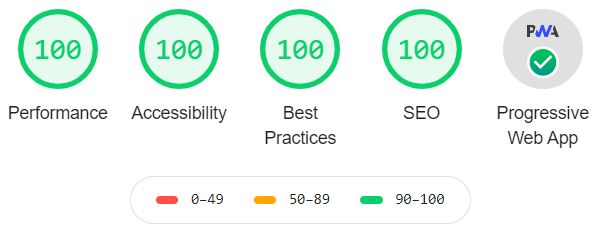

## 🥂 the great gatsby starter

_A base starter with formatting, linting, serverless, CSS in JS, analytics, SEO, and PWA support included._

[![netlify][netlify-badge]][netlify]
[![github actions][github-actions-badge]][github-actions]
[![codecov][codecov-badge]][codecov]
[![contributing][contributing-badge]][contributing]
[![contributors][contributors-badge]][contributors]
[![discord][discord-badge]][discord]

### 🔰 getting started

Use the [Gatsby CLI][gatsby-cli] to create a new directory and install the starter.

```shell
gatsby new my-starter https://github.com/bradgarropy/gatsby-starter
```

Start up the site by running the `npm start` script.

```shell
cd my-starter
npm start
```

Now your site is up and running at http://localhost:8000!

### 📦 what's included

-   [TypeScript][typescript]
-   [Prettier][prettier]
-   [ESLint][eslint]
-   [Netlify Functions][netlify-functions]
-   [Google Analytics][analytics]
-   [SEO][seo]
-   [PWA][pwa]

<div align="center">
    <p><em>It also has a perfect <a href="https://developers.google.com/web/tools/lighthouse">Lighthouse</a> score!</em></p>
    
</div>

### 🚀 deploy your own

Clicking the deploy button below will create a [GitHub][github] repository for you, link it to [Netlify][netlify], and deploy the site.

[![Deploy to netlify][deploy-button]][deploy]

### ❔ questions

🐛 report bugs by filing [issues][issues]  
📢 provide feedback with [issues][issues] or on [twitter][twitter]  
🙋🏼‍♂️ use my [ama][ama] or [twitter][twitter] to ask any other questions

### ✨ contributors

<!-- ALL-CONTRIBUTORS-LIST:START - Do not remove or modify this section -->
<!-- prettier-ignore-start -->
<!-- markdownlint-disable -->
<table>
  <tr>
    <td align="center"><a href="https://bradgarropy.com"><br /><sub><b>Brad Garropy</b></sub></a><br /><a href="https://github.com/bradgarropy/gatsby-starter/commits?author=bradgarropy" title="Code">💻</a> <a href="#design-bradgarropy" title="Design">🎨</a> <a href="https://github.com/bradgarropy/gatsby-starter/commits?author=bradgarropy" title="Documentation">📖</a> <a href="#infra-bradgarropy" title="Infrastructure (Hosting, Build-Tools, etc)">🚇</a> <a href="https://github.com/bradgarropy/gatsby-starter/commits?author=bradgarropy" title="Tests">⚠️</a></td>
  </tr>
</table>

<!-- markdownlint-restore -->
<!-- prettier-ignore-end -->

<!-- ALL-CONTRIBUTORS-LIST:END -->

[netlify]: https://app.netlify.com/sites/the-great-gatsby-starter/deploys
[netlify-badge]: https://img.shields.io/netlify/2562ae85-75a6-4cb8-bd88-306aeeef816e?style=flat-square
[github-actions]: https://github.com/bradgarropy/gatsby-starter/actions
[github-actions-badge]: https://img.shields.io/github/workflow/status/bradgarropy/gatsby-starter/%F0%9F%A7%AA%20test?style=flat-square
[codecov]: https://app.codecov.io/gh/bradgarropy/gatsby-starter
[codecov-badge]: https://img.shields.io/codecov/c/github/bradgarropy/gatsby-starter?style=flat-square
[contributing]: https://github.com/bradgarropy/gatsby-starter/blob/master/contributing.md
[contributing-badge]: https://img.shields.io/badge/PRs-welcome-success?style=flat-square
[contributors]: #-contributors
[contributors-badge]: https://img.shields.io/github/all-contributors/bradgarropy/gatsby-starter?style=flat-square
[discord]: https://bradgarropy.com/discord
[discord-badge]: https://img.shields.io/discord/748196643140010015?style=flat-square\
[gatsby-cli]: https://www.npmjs.com/package/gatsby-cli
[typescript]: https://www.typescriptlang.org
[prettier]: https://prettier.io
[eslint]: https://eslint.org
[netlify-functions]: https://www.netlify.com/products/functions
[analytics]: https://analytics.google.com
[seo]: https://www.npmjs.com/package/@bradgarropy/gatsby-plugin-seo
[pwa]: https://www.npmjs.com/package/gatsby-plugin-manifest
[github]: https://github.com
[netlify]: https://netlify.com
[deploy-button]: https://www.netlify.com/img/deploy/button.svg
[deploy]: https://app.netlify.com/start/deploy?repository=https://github.com/bradgarropy/gatsby-starter
[issues]: https://github.com/bradgarropy/gatsby-starter/issues
[twitter]: https://twitter.com/bradgarropy
[ama]: https://bradgarropy.com/ama
